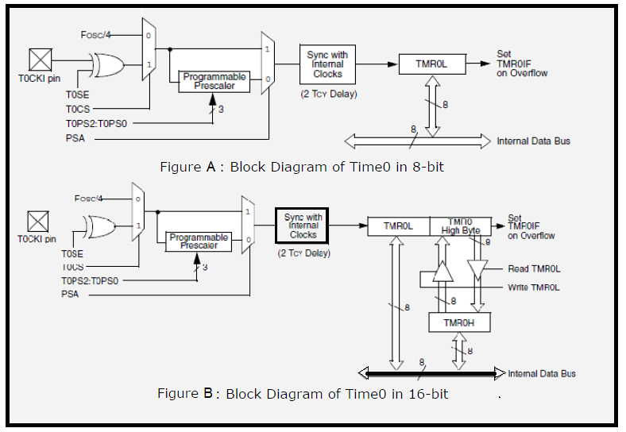

## Theory :

#### 1. Timer

 The microcontroller oscillator uses quartz crystal for its operation. Even though it is not the simplest solution, there are many reasons to use it. The frequency of such oscillator is precisely defined and very stable, so that pulses it generates are always of the same width, which makes them ideal for time measurement. Such oscillators are also used in quartz watches. If it is necessary to measure time between two events, it is sufficient to count up pulses generated by this oscillator. This is exactly what the timer does. Most programs use these miniature electronic ‘stopwatches'. These are commonly 8- or 16-bit SFRs the contents of which are automatically incremented by each coming pulse. Once a register is completely loaded and overflowed, an interrupt may be generated! 
 If the timer uses an internal quartz oscillator for its operation then it can be used to measure time between two events (if the register value is A at the moment measurement starts, and B at the moment it terminates, then the elapsed time is equal to the result of subtraction B - A). If registers use pulses coming from external source then such a timer is turned into a counter.

##### 1.1 How does the timer operate?

 In practice, pulses generated by the quartz oscillator are once per each machine cycle, directly or via a prescaler, brought to the circuit which increments the number stored in the timer register. If one instruction (one machine cycle) lasts for four quartz oscillator periods then this number will be incremented a million times per second (each microsecond) by embedding quartz with the frequency of 4MHz. It is easy to measure short time intervals, up to 256 microseconds, in the way described above because it is the largest number that one register can store. This restriction may be easily overcome in several ways such as by using a slower oscillator, registers with more bits, prescaler or interrupts. The first two solutions have some weaknesses so it is more recommended to use prescaler or interrupt.

##### 1.2 Using a prescaler in timer operation

 A prescaler is an electronic device used to reduce frequency by a predetermined factor. In order to generate one pulse on its output, it is necessary to bring 1, 2 , 4 or more pulses on its input. Most microcontrollers have one or more prescaler built in and their division rate may be changed from within the program. The prescaler is used when it is necessary to measure longer periods of time. If one prescaler is shared by timer and watchdog timer, it cannot be used by both of them simultaneously.

##### 1.3 Using interrupt in timer operation

 If the timer register consists of 8 bits, the largest number it can store is 255. As for 16-bit registers it is the number 65535. If this number is exceeded, the timer will be automatically reset and counting will start at zero again. This condition is called an overflow. If enabled from within the program, the overflow can cause an interrupt, which gives completely new possibilities. For example, the state of registers used for counting seconds, minutes or days can be changed in an interrupt routine. The whole process (except for interrupt routine) is automatically performed behind the scenes, which enables the main circuits of the microcontroller to operate normally. This figure 3 illustrates the use of an interrupt in timer operation. Delays of arbitrary duration, having almost no influence on the main program execution, can be easily obtained by assigning the prescaler to the timer.

#### 2. Counters

 If the timer receives pulses from the microcontroller input pin, then it turns into a counter. Obviously, it is the same electronic circuit able to operate in two different modes. The only difference is that in this case pulses to be counted come over the microcontroller input pin and their duration (width) is mostly undefined. This is why they cannot be used for time measurement, but for other purposes such as counting products on an assembly line, number of axis rotation, passengers etc. (depending on sensor in use).

#### 3. Timers / Counters in PIC Microcontroller

 There are 3 - 5 timers on board in PIC microcontroller. These timers can also be used as counters when external pulses are applied. The timers are programmable, and sometimes share with other peripheral devices. These are named as TMR0, TMR1, TMR2, TMR3 and TMR4. There are few other timers, not to be discussed here like Watchdog Timer and Brown-Out timers. These timers are useful in measuring the time delays in various events as well as counting and timing external events.

**Comparison of Timers in PIC Microcontroller**

| Parameter   | Timer 0 | Timer 1 & 3 | Timer 2 & 4 |
|----------|----------|----------|----------|
| Size of timer register    | 8-bit or 16-bit | 16-bit   | 8-bit  |
| Clock Source (Internal)  |Fosc/   | Fosc/4   |F}_{osc}/4$$  |
|Clock Source (External)     | T0CKI Pin T13CKI Pin   | T1OSC   | None  |
|Clock Scaling (Prescaler)| Prescaler 2-bits(1:1 -> 1:8) | Prescaler(1:1, 1:4, 1:8)   | Postscaler(1:1 ->1:16)  |
| Interrupt Event|On Overflow|On Overflow| TMR Reg matches with PR2 |

#### 4. Timer0 Module in PIC Microcontroller

The Timer0 module incorporates the following features:
- Software selectable operation as a timer or
- counter in both 8-bit or 16-bit modes
- Readable and writable registers
- Dedicated 8-bit, software programmable
- prescaler
- Selectable clock source (internal or external)
- Edge select for external clock
- Interrupt on overflow 

 The T0CON register (Register 11-1) controls all aspects of the module’s operation, including the prescale selection. It is both readable and writable.  Figure A. shows a simplified block diagram of the Timer0 module in 8-bit mode. Figure B. shows a simplified block diagram of the Timer0 module in 16-bit mode.

##### 4.1 Timer0 Operation

 Timer0 can operate as either a timer or a counter; the mode is selected by clearing the T0CS bit (T0CON<5>). In Timer mode, the module increments on every clock by default unless a different prescaler value is selected. If the TMR0 register is written to, the increment is inhibited for the following two instruction cycles. The user can work around this by writing an adjusted value to the TMR0 register. The Counter mode is selected by setting the T0CS bit (= 1). In Counter mode, Timer0 increments either on every rising or falling edge of pin RA4/T0CKI. The incrementing edge is determined by the Timer0 Source Edge Select bit, T0SE (T0CON<4>); clearing this bit selects the rising edge. An external clock source can be used to drive Timer0; however, it must meet certain requirements to ensure that the external clock can be synchronized with the internal phase clock (TOSC). There is a delay between synchronization and the onset of incrementing the timer/counter.

##### 4.2 Prescaler

 An 8-bit counter is available as a prescaler for the Timer0 module. The prescaler is not directly readable or writable; its value is set by the PSA and T0PS2:T0PS0 bits (T0CON<3:0>) which determine the prescaler assignment and prescale ratio. Clearing the PSA bit assigns the prescaler to the Timer0 module. When it is assigned, prescale values from 1:2 through 1:256, in power-of-2 increments are selectable. When assigned to the Timer0 module, all instructions writing to the TMR0 register clear the prescaler count.

##### 4.3 Timer0 Interrupt

 The TMR0 interrupt is generated when the TMR0 register overflows from FFh to 00h in 8-bit mode, or from FFFFh to 0000h in 16-bit mode. This overflow sets the TMR0IF flag bit. The interrupt can be masked by clearing the TMR0IE bit (INTCON<5>). Before reenabling the interrupt, the TMR0IF bit must be cleared in software by the Interrupt Service Routine. Since Timer0 is shut down in Sleep mode, the TMR0 interrupt cannot awaken the processor from Sleep.  

##### 4.4 Timer0 Register Map:

| SFR | Description | Access | Reset Value | Address |
|------|------|------|------|------|
| T0CON | Timer0 Control Register |  Read/Write | 0xFF | 0xFD5 |
| TMR0L |  Timer0  Register Lower Byte | Read/Write | UNKNOWN | 0xFD6 |
| TMR0H |Timer0 Register Higher Byte| Read/Write | 0x00 | 0xFD7 |
| INTCON | Interrupt Control Register |Read/Write | 0x00| 0xFF2 |
| INTCON2 | Interrupt Control Register 2 | Read/Write| 0xFF| 0xFF1|

##### Register (SFR) Description

###### **4.4.1 TMR0L : Used 8-bit and 16bit mode. The register holds the current count**

value which is updated by clock source. User must write initial value.

###### **4.4.2 TMR0H : Used only in 16-bit mode. The register holds the higher byte**

current count value which is updated by clock source.

 | R/W - 1 | R/W - 1 | R/W - 1 | R/W - 1 | R/W - 1 | R/W - 1 | R/W - 1 | R/W - 1 |
|------|------|------|------|-------|------|------|------|
|TMR0ON|T08BIT|T0CS|T0SE|PSA|T0PS2|T0PS1|T0PS0 |
|bit-7|||||||bit-0 |

 | **Bit No.** | **Control Bit** |**Description** | 
|------|------|------|
|Bit 7|TMR0ON|Timer0 On/Off Control bit   1 = Enables Timer0, 0 = Stops Timer0|
|Bit 6|T08BIT|Timer0 8-Bit/16-Bit Control bit   1 = Timer0 is configured as an 8-bit timer/counter   0 = Timer0 is configured as a 16-bit timer/counter|
|Bit 5|T0CS|Timer0 Clock Source Select bit   1= Transition on T0CKI pin   0 = Internal instruction cycle clock (CLKO)|
|Bit 4|T0SE|Timer0 Source Edge Select bit   1 = Increment on high-to-low transition on T0CKI pin   0 = Increment on low-to-high transition on T0CKI pin|
|Bit 3|PSA|Timer0 Prescaler Assignment bit   1 = TImer0 prescaler is NOT assigned.   0 = Timer0 prescaler is assigned.|
|Bit 2-0|T0PS2:T0PS0|Timer0 Prescaler Select bits   111 = 1:256 Prescale value   110 = 1:128 Prescale value   101 = 1:64 Prescale value   100 = 1:32 Prescale value   011 = 1:16 Prescale value   010 = 1:8 Prescale value   001 = 1:4 Prescale value   000 = 1:2 Prescale value|

###### **4.4.4 INTCON: Interrupt Control Register**

| R/W - 0 | R/W - 0 | R/W - 0 | R/W - 0 | R/W - 0 | R/W - 0 | R/W -0 | R/W - 0 |
|------|------|------|------|-------|------|------|------|
|GIE/GIEH|PEIE/GIEL|TMR0IE|INT0IE|RBIE|TMR0IF|INT0IF| RBIF^1 |
|bit-7|||||||bit-0 |

 | **Bit No.** | **Control Bit** |Description | 
|------|------|------|
|Bit 7| GIE/GIEH |Global Interrupt Enable bit When IPEN = 0:   1 = Enables all unmasked interrupts   0 = Disables all interrupts   When IPEN = 1:   1 = Enables all high priority interrupts   0 = Disables all high priority interrupts|
|Bit 6 |PEIE/GIEL| Peripheral Interrupt Enable bit |
|Bit 5 |TMR0IE| TMR0 Overflow Interrupt Enable bit   1 = Enables the TMR0 overflow interrupt   0 = Disables the TMR0 overflow interrupt |
|Bit 4 | INT0IE | INT0 External Interrupt Enable bit   1 = Enables the INT0 external interrupt   0 = Disables the INT0 external interrupt|
|Bit 3| RBIE |RB Port Change Interrupt Enable bit   1 = Enables the RB port change interrupt   0 = Disables the RB port change interrupt|
|Bit 2| TMR0IF |TMR0 Overflow Interrupt Flag bit   1 = TMR0 register has overflowed (must be cleared in software)   0 = TMR0 register did not overflow
|Bit 1| INT0IF| INT0 External Interrupt Flag bit   1 = The INT0 external interrupt occurred (must be cleared in software)   0 = The INT0 external interrupt did not occur|
|Bit 0 | RBIF | RB Port Change Interrupt Flag bit(1)   1 = At least one of the RB7:RB4 pins changed state (must be cleared in software)   0 = None of the RB7:RB4 pins have changed state

#### 5. Time delay generation using timer:

 The following steps are taken to generate a time delay using polling method
   **i.** Load the proper value in T0CON indicating which timer mode, clock source, prescaler assignment.
   **ii.** Load the registers TMR0H first and then TMR0L with initial count values. Delay generated is Depends upon the initial count value.
   **iii.** Start the timer by setting TMR0ON bit in T0CON.
   **iv.** Keep the monitoring the timer flag (TMR0IF).
   **v.** Get out of the loop when TMR0IF becomes high.
   **vi.** Stop the timer.
   **vii.** Clear the TMR0IF flag for the next round.
   **viii.** Go back to the step 2 to load TMR0H and TMR0L values.

**The following steps are taken to generate a time delay using interrupt method** 

   **i.** Load the proper value in T0CON indicating which timer mode, clock
source, prescaler assignment.
   **ii.** Load the registers TMR0H first and then TMR0L with initial count values.
Delay generated is Depends upon the initial count value.
   **iii.** Enable the Timer0 Interrupt and Global Interrupt using INTCON Register
   **iv.** Start the timer by setting TMR0ON bit in T0CON.
   **v.** Write the ISR at Interrupt vector 0x0018.
     a. In ISR Clear the TMR0IF flag for the next round.
    b. In ISR reload TMR0H and TMR0L values.
The size of the time delay depends on two factors, (a) the crystal frequency and (b) the timer’s 16-bit register (c) the prescaler value. The largest delay is achieved by the making both TMR0H and TMR0L zero and using maximum prescaler value i.e. 1:256.

